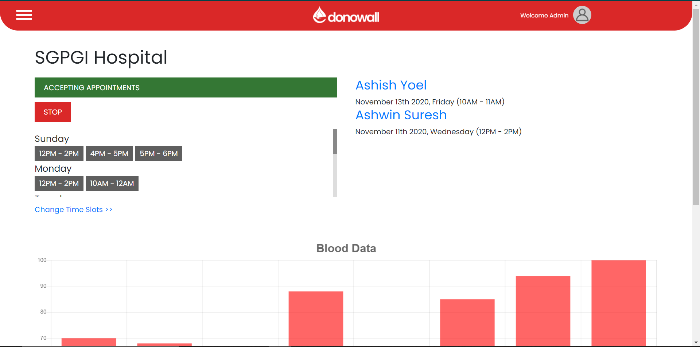
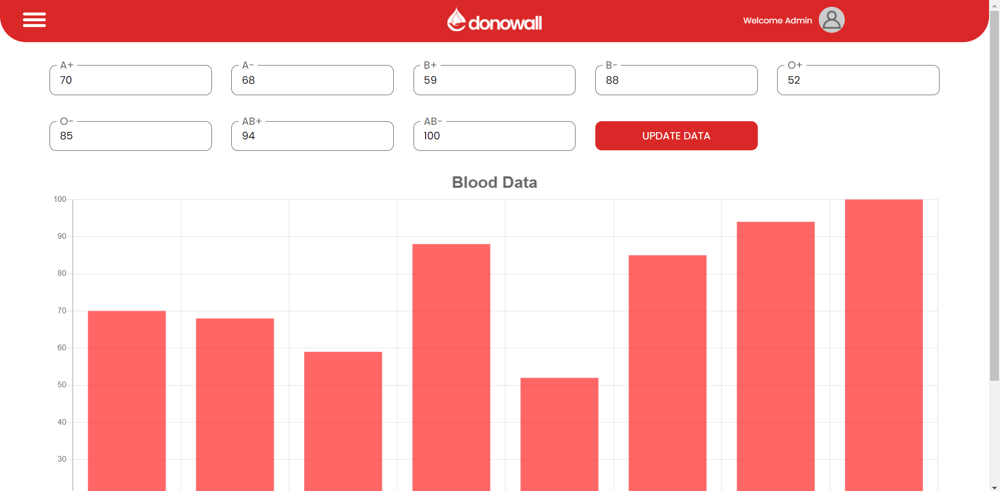
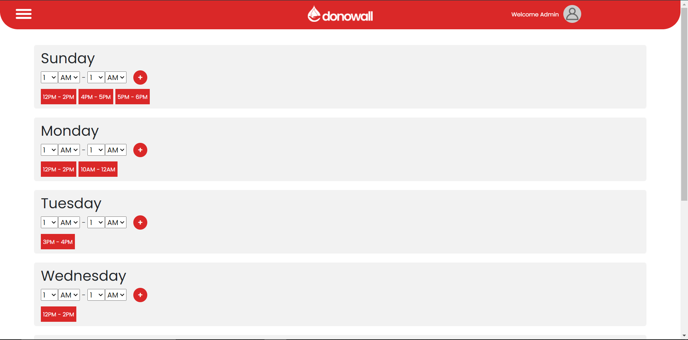
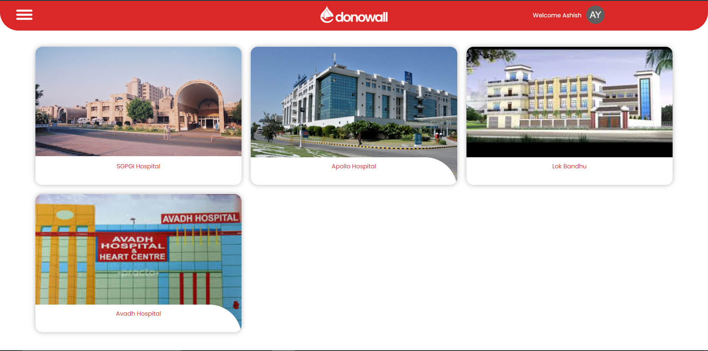
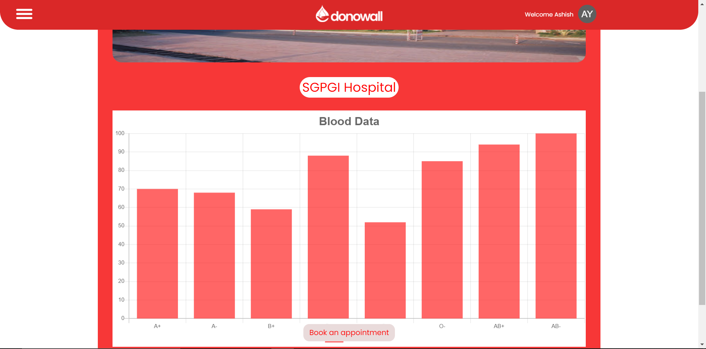
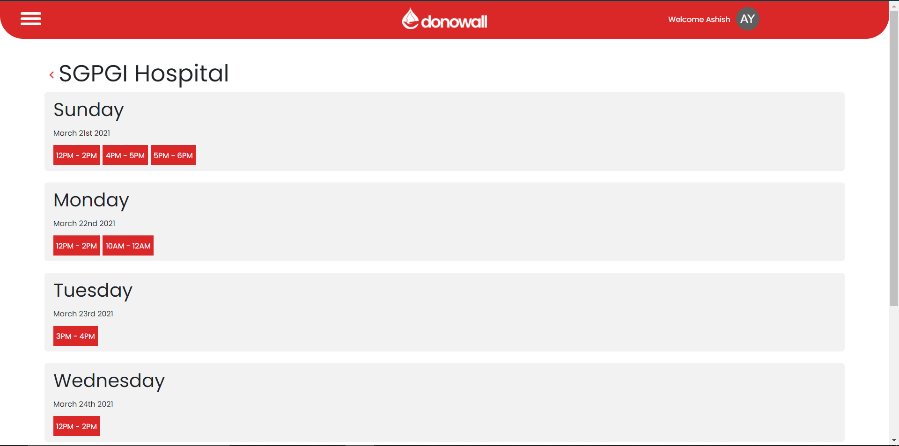

## DONOWALL

> Donowall aspires to bridge that gap between patients need's and hospital's blood availablity by giving them a common medium where they can connect.

#### OUR APP HAVE 2 END USERS:
* __HOSPITAL ADMIN__
    * A representative of a hospital, has to sign up with the necesarry details such as city, state, contact, and __current blood availability__.
    
    * The admin can always change the blood amount present currently in the hospital. The blood data will be plotted on the graph making it very visual.
     

    * __Hospital Home Page__
    
     

    * __Hospital Blood Data Change__
    
     

    * __Hospital Slots__
    
     

* __BLOOD DONAR__
    * The Donar has to sign up necessary details such as name, city, state and contact.
    * The user will then be taken to the homepage where all the hospitals nearby the user will be listed out.
    * The user can visit the hospital's profile and check the availability of the blood. 
    * The donar can book an appointment with the hospital for blood donation. The donar has to make sure that the hospital is currently accepting appointments.
     

    * __User Home Page__
    
     

    * __User View Hospital__
    
     

    * __User Book Appointment__
    
     

__[Application Demo](https://donowall.netlify.app/)__